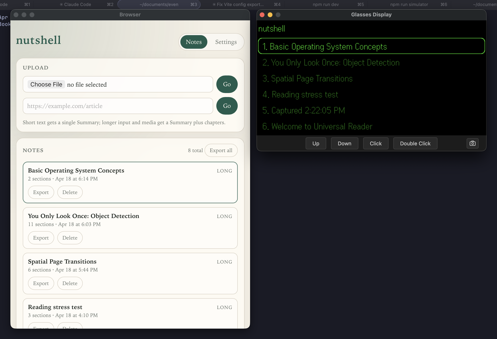

# Nutshell

A universal reader for your Even G2 glasses.

Imagine you're walking to a meeting. You have a 40-page PDF you were supposed to read, an article someone DM'd you, a photo of a whiteboard you haven't transcribed, and a link to documentation you haven't read.

What if all of that was already in your field of view, distilled down to what matters?

## What it does

Nutshell accepts any document — PDFs, articles, links, photos, even your own voice — and turns them into a simple, readable stream on your Even Realities glasses.

- **Universal input.** Drop in a file, URL, or image. Nutshell handles the rest.
- **Simple glasses UI.** Three screens: home, overview, reading. Scroll, click, done.
- **AI-enhanced.** Summaries and Q&A so you only read what matters.
- **Save your notes.** One-click markdown export, straight to disk.

## Phone view

The companion web view — drop in a file or URL, browse your notes, export to markdown.

## On the glasses

Three screens. Scroll to navigate, tap to open, double-tap to go back.

**Overview** — split view. Section headings on the left, live preview on the right.

Scroll the temple to jump between sections; the preview updates as you go.

**Reading** — tap a section to drop into fullscreen text. Pages span the entire note.

